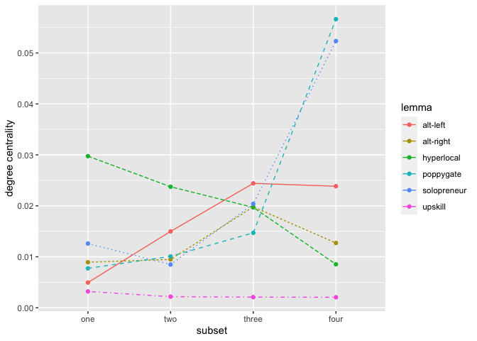
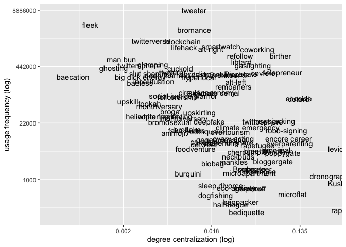
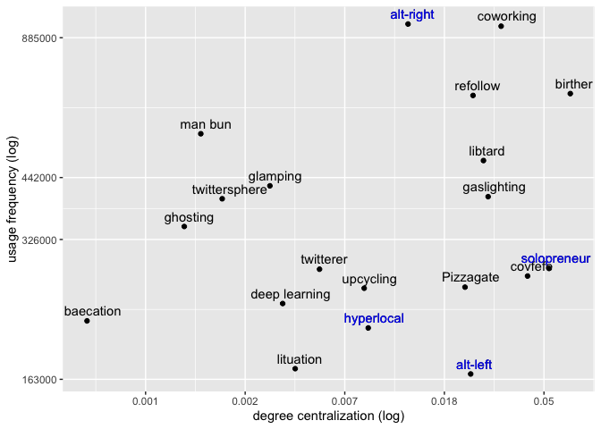

Social networks of lexical innovation
================
Quirin Würschinger

-   [Load code](#load-code)
-   [Variables](#variables)
-   [Load data](#load-data)
-   [Table 1: Overall usage frequency](#table-1-overall-usage-frequency)
-   [Figure 1: Cumulative increase in usage frequency (case
    studies)](#figure-1-cumulative-increase-in-usage-frequency-case-studies)
-   [Figure 2: Temporal dynamics in usage
    frequency](#figure-2-temporal-dynamics-in-usage-frequency)
-   [Table 2: Coefficients of
    variation](#table-2-coefficients-of-variation)
-   [Table 3: Degree centrality
    scores](#table-3-degree-centrality-scores)
-   [Figure 4: Degrees of diffusion for case studies in Subset
    4](#figure-4-degrees-of-diffusion-for-case-studies-in-subset-4)
-   [Figure 5: Pathways of social
    diffusion](#figure-5-pathways-of-social-diffusion)
-   [Figure 6: Social diffusion over time for
    *hyperlocal*.](#figure-6-social-diffusion-over-time-for-hyperlocal)
-   [Table 4: Correlations for ‘degree
    centrality’](#table-4-correlations-for-degree-centrality)
-   [Figure 7: Relationship between FREQUENCY and
    CENTRALITY](#figure-7-relationship-between-frequency-and-centrality)

# Load code

## Packages

``` r
library('corrr')
library(tidyr)
library(magrittr)
library(forcats)
library(broom)
```

## Custom scripts

``` r
source('src/load-data.R') 
source('src/postproc.R')
source('src/uses.R')
source('src/users.R')
source('src/sna.R')
source('src/analysis.R')
```

# Variables

``` r
corpus <- '~/data/twint/twint/'

subsetting = 'time'
diff_start_method <- 'edges'
diff_start_limit <- 3

cases <- c(
  'upskill',
  'hyperlocal',
  'solopreneur',
  'alt-right',
  'alt-left',
  'poppygate'
  )
```

# Load data

Load the aggregate data resulting from `processing.R`:

``` r
if (exists('df_comp') == FALSE) {
  df_comp <- read_df_comp(f_path='out/df_comp.csv')
}
```

    ## 
    ## ── Column specification ────────────────────────────────────────────────────────
    ## cols(
    ##   .default = col_double(),
    ##   LEMMA = col_character(),
    ##   SUBSET = col_character(),
    ##   START = col_date(format = ""),
    ##   END = col_date(format = ""),
    ##   COMMUNITIES = col_logical(),
    ##   MODULARITY = col_logical(),
    ##   SUBSETTING = col_character(),
    ##   DIFF_START_METHOD = col_character(),
    ##   SKIP = col_logical(),
    ##   STAMP = col_datetime(format = "")
    ## )
    ## ℹ Use `spec()` for the full column specifications.

Filter records to relevant subsetting method:

``` r
df_comp %<>% 
  filter(
    SKIP != TRUE,
    SUBSETTING == subsetting,
  )
```

# Table 1: Overall usage frequency

``` r
df_stats <- tibble(
  STAT = c('MIN', 'MAX', 'MEAN', 'MEDIAN'),
  VALUE = c(min(df_comp$USES_TOT), max(df_comp$USES_TOT), mean(df_comp$USES_TOT), median(df_comp$USES_TOT))
  )

exs_min <- df_comp %>% 
  filter(SUBSET == 'full') %>%
  arrange(USES_TOT) %>%
  select(LEMMA, USES_TOT) %>%
  top_n(-6, USES_TOT) %>%
  mutate(GROUP = 'min')
  
exs_max <- df_comp %>% 
  filter(SUBSET == 'full') %>%
  arrange(desc(USES_TOT)) %>%
  select(LEMMA, USES_TOT) %>%
  top_n(6, USES_TOT) %>%
  mutate(GROUP = 'max')

exs_median <- df_comp %>% 
  filter(SUBSET == 'full') %>%
  arrange(desc(USES_TOT)) %>%
  filter(USES_TOT <= df_stats %>% filter(STAT == 'MEDIAN') %>% pull(VALUE)) %>%
  select(LEMMA, USES_TOT) %>%
  top_n(6, USES_TOT) %>%
  mutate(GROUP = 'median')

exs_mean <- df_comp %>% 
  filter(SUBSET == 'full') %>%
  arrange(USES_TOT) %>%
  filter(USES_TOT >= df_stats %>% filter(STAT == 'MEAN') %>% pull(VALUE)) %>%
  select(LEMMA, USES_TOT) %>%
  top_n(-6, USES_TOT) %>%
  mutate(GROUP = 'mean')

exs_cases <- df_comp %>%
  filter(SUBSET == 'full') %>%
  arrange(desc(USES_TOT)) %>%
  filter(LEMMA %in% cases) %>%
  select(LEMMA, USES_TOT) %>%
  mutate(GROUP = 'case')

df_examples <- bind_rows(exs_min, exs_max, exs_median, exs_mean, exs_cases)

df_examples %<>% 
  mutate(GROUP = factor(GROUP, c('min', 'median', 'mean', 'max', 'case'))) %>%
  arrange(GROUP)

df_examples
```

    ## # A tibble: 30 x 3
    ##    LEMMA                USES_TOT GROUP 
    ##    <chr>                   <dbl> <fct> 
    ##  1 bediquette                164 min   
    ##  2 rapugee                   182 min   
    ##  3 halfalogue                245 min   
    ##  4 begpacker                 283 min   
    ##  5 dogfishing                399 min   
    ##  6 microflat                 426 min   
    ##  7 helicopter parenting    26393 median
    ##  8 monthiversary           23607 median
    ##  9 newsjacking             20930 median
    ## 10 deepfake                20101 median
    ## # … with 20 more rows

# Figure 1: Cumulative increase in usage frequency (case studies)

This code cannot be executed since it requires the original tweet data.

``` r
uses_cum <- NULL
# lemmas_done <- uses_cum %>% distinct(LEMMA) %>% pull()
for (lemma in cases) {
  tweets <- load_data(corpus, lemma)
  tweets <- postproc(tweets)
  tweets <- filter_tweets(tweets)
  uses <- get_uses(tweets)
  uses_month <- bin_uses(uses, 'month')
  uses_month %<>%
   mutate(LEMMA = lemma) %>%
   mutate(USES_CUM = cumsum(USES))
  uses_cum <- bind_rows(uses_cum, uses_month)
}
```

``` r
uses_cum %>%
  mutate(LEMMA = fct_reorder(LEMMA, USES_CUM, max, .desc=TRUE)) %>%
  filter(LEMMA %in% c(cases)) %>%
  filter(LEMMA != 'alt-right') %>%
  ggplot(data=., aes(x=DATE, y=USES_CUM, color=LEMMA, linetype=LEMMA)) +
    geom_line() +
    scale_y_continuous('cumulative usage frequency', labels=scales::comma) +
    scale_x_date('')

# ggsave('~/out/freq_cum_cases.pdf', width=8, height=4)
```

# Figure 2: Temporal dynamics in usage frequency

These plots cannot be generated here, since the orginal tweets dataset
would be required. The plots were created for all lexemes during the
data processing. The code for creating the plots can be found in
`scr/processing.R`.

# Table 2: Coefficients of variation

``` r
coef_var <- df_comp %>%
  filter(
    SUBSET == 'full',
    AGE >= 365,
    USES_TOT >= 2000,
    ) %>%
  select(LEMMA, COEF_VAR)

coef_var_cases <- coef_var %>%
  filter(LEMMA %in% cases) %>%
  arrange(COEF_VAR)

coef_var_high <- coef_var %>%
  arrange(desc(COEF_VAR)) %>%
  top_n(6, COEF_VAR)

coef_var_low <- coef_var %>%
  arrange((COEF_VAR)) %>%
  top_n(-6, COEF_VAR)


print(coef_var_cases)
```

    ## # A tibble: 6 x 2
    ##   LEMMA       COEF_VAR
    ##   <chr>          <dbl>
    ## 1 hyperlocal     0.978
    ## 2 upskill        1.14 
    ## 3 solopreneur    1.20 
    ## 4 alt-right      1.78 
    ## 5 poppygate      4.75 
    ## 6 alt-left       5.31

``` r
print(coef_var_high)
```

    ## # A tibble: 6 x 2
    ##   LEMMA      COEF_VAR
    ##   <chr>         <dbl>
    ## 1 upskirting     9.39
    ## 2 youthquake     6.32
    ## 3 alt-left       5.31
    ## 4 birther        5.00
    ## 5 poppygate      4.75
    ## 6 cherpumple     4.69

``` r
print(coef_var_low)
```

    ## # A tibble: 6 x 2
    ##   LEMMA         COEF_VAR
    ##   <chr>            <dbl>
    ## 1 followership     0.715
    ## 2 lituation        0.717
    ## 3 twitterverse     0.722
    ## 4 detweet          0.744
    ## 5 remoaners        0.761
    ## 6 twittersphere    0.767

# Table 3: Degree centrality scores

``` r
cent_deg <-  df_comp %>%
  select(LEMMA, SUBSET, CENT_DEGREE) %>%
  filter(SUBSET == 'four') %>%
  select(-SUBSET) %>%
  arrange(CENT_DEGREE)

cent_deg_cases <- cent_deg %>%
  filter(LEMMA %in% cases)

cent_deg_low <- cent_deg %>%
  top_n(-6, CENT_DEGREE)

cent_deg_high <- cent_deg %>%
  top_n(6, CENT_DEGREE) %>%
  arrange(desc(CENT_DEGREE))

print(cent_deg_cases)
```

    ## # A tibble: 6 x 2
    ##   LEMMA       CENT_DEGREE
    ##   <chr>             <dbl>
    ## 1 upskill         0.00206
    ## 2 hyperlocal      0.00853
    ## 3 alt-right       0.0127 
    ## 4 alt-left        0.0238 
    ## 5 solopreneur     0.0523 
    ## 6 poppygate       0.0566

``` r
print(cent_deg_low)
```

    ## # A tibble: 6 x 2
    ##   LEMMA           CENT_DEGREE
    ##   <chr>                 <dbl>
    ## 1 baecation          0.000506
    ## 2 fleek              0.000942
    ## 3 ghosting           0.00134 
    ## 4 man bun            0.00159 
    ## 5 big dick energy    0.00182 
    ## 6 twittersphere      0.00197

``` r
print(cent_deg_high)
```

    ## # A tibble: 6 x 2
    ##   LEMMA       CENT_DEGREE
    ##   <chr>             <dbl>
    ## 1 rapugee          0.258 
    ## 2 levidrome        0.237 
    ## 3 Kushnergate      0.231 
    ## 4 dronography      0.153 
    ## 5 dotard           0.0979
    ## 6 ecocide          0.0922

# Figure 4: Degrees of diffusion for case studies in Subset 4

The network graphs are not presented here since they were generated
using `Gephi`. The code for generating the network graphs and exporting
the edges and nodes of the network for visualisation in `Gephi` can be
found in `src/sna.R`.

# Figure 5: Pathways of social diffusion

``` r
df_comp %>%
  select(LEMMA, SUBSET, CENT_DEGREE) %>%
  filter(
    SUBSET != 'full',
    LEMMA %in% c(cases)
  ) %>%
  ggplot(., aes(x=SUBSET, y=CENT_DEGREE)) +
    geom_point(aes(group=LEMMA, color=LEMMA)) +
    geom_line(aes(group=LEMMA, color=LEMMA, linetype=LEMMA)) +
    guides(group=TRUE) +
    scale_y_continuous('degree centrality') +
    scale_x_discrete('subset') +
    scale_color_discrete('lemma') +
    scale_linetype_discrete(guide=FALSE)
```

    ## Warning: It is deprecated to specify `guide = FALSE` to remove a guide. Please
    ## use `guide = "none"` instead.

<!-- -->

# Figure 6: Social diffusion over time for *hyperlocal*.

The network graphs are not presented here since they were generated
using `Gephi`. The code for generating the network graphs and exporting
the edges and nodes of the network for visualisation in `Gephi` can be
found in `src/sna.R`.

# Table 4: Correlations for ‘degree centrality’

## Log-transformation and centering

``` r
df_comp %<>%
  mutate(CENT_DEGREE_LOG_CENT = scale(log(CENT_DEGREE)), scale=FALSE) %>%
  mutate(USES_LOG_CENT = scale(log(USES)), scale=FALSE) %>%
  mutate(USES_TOT_LOG_CENT = scale(log(USES_TOT)), scale=FALSE) %>%
  mutate(AGE_LOG_CENT = scale(log(AGE)), scale=FALSE) %>%
  mutate(COEF_VAR_LOG_CENT = scale(log(COEF_VAR)), scale=FALSE)
```

## Correlation tests: `CENT_DEGREE` X …

### with FREQUENCY

#### Spearman

``` r
df_comp %>%
  filter(SUBSET != 'full') %>%
  do(tidy(cor.test(df_comp$CENT_DEGREE_LOG_CENT, df_comp$USES_LOG_CENT,  method='spearman')))
```

    ## # A tibble: 1 x 5
    ##   estimate statistic  p.value method                          alternative
    ##      <dbl>     <dbl>    <dbl> <chr>                           <chr>      
    ## 1   -0.437 29045975. 1.73e-24 Spearman's rank correlation rho two.sided

#### Pearson

``` r
df_comp %>%
  filter(SUBSET != 'full') %>%
  do(tidy(cor.test(df_comp$CENT_DEGREE_LOG_CENT, df_comp$USES_LOG_CENT,  method='pearson')))
```

    ## # A tibble: 1 x 8
    ##   estimate statistic  p.value parameter conf.low conf.high method    alternative
    ##      <dbl>     <dbl>    <dbl>     <int>    <dbl>     <dbl> <chr>     <chr>      
    ## 1   -0.453     -11.3 2.11e-26       493   -0.520    -0.380 Pearson'… two.sided

### with AGE

#### Spearman

``` r
df_comp %>%
  filter(SUBSET == 'full') %>%
  do(tidy((cor.test(.$CENT_DEGREE_LOG_CENT, .$AGE_LOG_CENT,  method='spearman'))))
```

    ## # A tibble: 1 x 5
    ##   estimate statistic p.value method                          alternative
    ##      <dbl>     <dbl>   <dbl> <chr>                           <chr>      
    ## 1   -0.289   208497. 0.00367 Spearman's rank correlation rho two.sided

#### Pearson

``` r
df_comp %>%
  filter(SUBSET == 'full') %>%
  do(tidy((cor.test(.$CENT_DEGREE_LOG_CENT, .$AGE_LOG_CENT,  method='pearson'))))
```

    ## # A tibble: 1 x 8
    ##   estimate statistic  p.value parameter conf.low conf.high method    alternative
    ##      <dbl>     <dbl>    <dbl>     <int>    <dbl>     <dbl> <chr>     <chr>      
    ## 1   -0.381     -4.06 0.000100        97   -0.538    -0.198 Pearson'… two.sided

### with VOLATILITY

#### Spearman

``` r
df_comp %>%
  filter(SUBSET != 'full') %>%
  do(tidy(cor.test(.$CENT_DEGREE_LOG_CENT, .$COEF_VAR_LOG_CENT, method='spearman')))
```

    ## # A tibble: 1 x 5
    ##   estimate statistic      p.value method                          alternative
    ##      <dbl>     <dbl>        <dbl> <chr>                           <chr>      
    ## 1    0.280  7456700. 0.0000000153 Spearman's rank correlation rho two.sided

#### Pearson

``` r
df_comp %>%
  filter(SUBSET != 'full') %>%
  do(tidy(cor.test(.$CENT_DEGREE_LOG_CENT, .$COEF_VAR_LOG_CENT, method='pearson')))
```

    ## # A tibble: 1 x 8
    ##   estimate statistic  p.value parameter conf.low conf.high method    alternative
    ##      <dbl>     <dbl>    <dbl>     <int>    <dbl>     <dbl> <chr>     <chr>      
    ## 1    0.230      4.69  3.76e-6       394    0.134     0.321 Pearson'… two.sided

## ‘predictive’ correlation

Correlation between

-   `CENT_DEGREE` in Subset 1 with
-   overall usage frequency

``` r
df_comp %>%
  filter(SUBSET == 'one') %>%
  do(tidy((cor.test(.$CENT_DEGREE_LOG_CENT, .$USES_TOT_LOG_CENT,  method='spearman'))))
```

    ## # A tibble: 1 x 5
    ##   estimate statistic   p.value method                          alternative
    ##      <dbl>     <dbl>     <dbl> <chr>                           <chr>      
    ## 1   -0.426    230594 0.0000134 Spearman's rank correlation rho two.sided

# Figure 7: Relationship between FREQUENCY and CENTRALITY

## Full sample

``` r
df_comp %>%
  filter(SUBSET == 'four') %>%
  select(LEMMA, CENT_DEGREE, USES_TOT, USES, EDGES) %>%
  ggplot(., aes(x=CENT_DEGREE, y=USES_TOT)) +
    geom_text(aes(label=LEMMA), hjust=-0.1, vjust=-0.1) + 
    scale_y_continuous(
      'usage frequency (log)', 
      trans='log',
      labels=function(x)round(x,-3)
      ) +
    scale_x_continuous(
      'degree centralization (log)',
      trans='log',
      labels=function(x)round(x,3)
      )
```

<!-- -->

## Case studies

``` r
subset <- 'four'

df_cases <- df_comp %>%
  filter(
    SUBSET == subset,
    LEMMA %in% c(cases),
    !LEMMA %in% c(
      'upskill',
      'poppygate'
      )
    )

cases_freq_min <- df_cases %>%
  dplyr::summarise(USES_MIN = min(USES_TOT)) %>%
  pull(USES_MIN)
  
cases_freq_max <- df_cases %>%
  dplyr::summarise(USES_MAX = max(USES_TOT)) %>%
  pull(USES_MAX)

df_comp %>%
  filter(
    SUBSET == subset,
    USES_TOT >= cases_freq_min,
    USES_TOT <= cases_freq_max,
    # filter specific lexemes to prevent overlap
    !LEMMA %in% c('big dick energy', 'slut shaming', 'cuckold', 'shareable', 'Brexiteer', 'incel', 'dashcam', 'refugee crisis')
    ) %>%
  select(LEMMA, CENT_DEGREE, USES_TOT, USES, EDGES) %>%
  ggplot(., aes(x=CENT_DEGREE, y=USES_TOT)) +
    geom_text(aes(label=LEMMA), color='black', hjust=.4, vjust=-.6) + 
    geom_text(data=df_cases, aes(label=LEMMA), color='blue', hjust=.4, vjust=-.6) +
    geom_point() + 
    scale_y_continuous(
      'usage frequency (log)', 
      trans='log',
      labels=function(x)round(x,-3)
      ) +
    scale_x_continuous(
      'degree centralization (log)',
      trans='log',
      labels=function(x)round(x,3)
      )
```

<!-- -->
